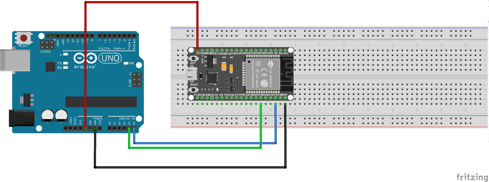

# Raport

## Partie 2

Pour cette deuxième partie de TP, nous avons connecté l'arduino à l'ESP 32 via I2C. Pour cela, nous televersons sur l'esp32 un premier code, ce code permet à l'ESP32 d'envoyer des informations à l'arduino. On dit que l'ESP32 est en "master mode":
```C
#include <Wire.h>
// Include the required Wire library for I2C<br>#include 
int x = 0;
void setup() {
  // Start the I2C Bus as Master
  Wire.begin(); 
}
void loop() {
  Wire.beginTransmission(9); // transmit to device #9
  Wire.write(x);              // sends x 
  Wire.endTransmission();    // stop transmitting
  x++; // Increment x
  if (x > 5) x = 0; // `reset x once it gets 6
  delay(500);
}
```

Nous televersons un second code sur l'arduino, afin qu'il puisse recevoir les informations envoyées par l'ESP32. On dit que l'arduino est en "slave mode".

```C
#include <Wire.h>

// Include the required Wire library for I2C<br>#include <Wire.h>
int LED = LED_BUILTIN;
int x = 0;
void setup() {
  // Define the LED pin as Output
  Serial.begin(9600);
  pinMode (LED, OUTPUT);
  // Start the I2C Bus as Slave on address 9
  Wire.begin(9);
  Serial.println("Ok"); 
  
  // Attach a function to trigger when something is received.
  Wire.onReceive(receiveEvent);
}
void receiveEvent(int bytes) {
  x = Wire.read();    // read one character from the I2C
  Serial.println(x); 
}
void loop() {
  //If value received is 0 blink LED for 200 ms
  if (x == 0) {
    digitalWrite(LED, HIGH);
    delay(200);
    digitalWrite(LED, LOW);
    delay(200);
  }
  //If value received is 3 blink LED for 400 ms
  if (x == 3) {
    digitalWrite(LED, HIGH);
    delay(400);
    digitalWrite(LED, LOW);
    delay(400);
  }
```

Voici le shéma Fritzing du branchement:

<p align="center">
  
  </p>
